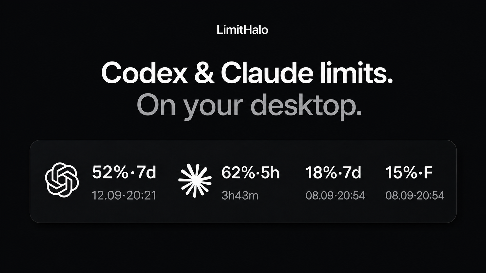
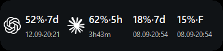

# LimitHalo

### AI limits. At a glance.

A small, transparent Windows widget for the quota you have left in Codex and, optionally, Claude. Keep it beside your work instead of opening another window to check.

**Public beta · Windows 10/11 x64 · English by default · MIT**

[Download for Windows](https://github.com/DenisShumilov/LimitHalo/releases/download/v1.0.1-beta.1/LimitHalo-1.0.1-Setup.exe) · [Portable](https://github.com/DenisShumilov/LimitHalo/releases/download/v1.0.1-beta.1/LimitHalo-1.0.1-Windows-x64.zip) · [Release notes](https://github.com/DenisShumilov/LimitHalo/releases) · [Report a bug](https://github.com/DenisShumilov/LimitHalo/issues/new?template=bug_report.yml)

[Install with AI](INSTALL_WITH_AI.md) · [Updates](docs/UPDATES.md) · [Privacy](PRIVACY.md) · [Українською](README.uk.md)

*AI-generated promotional concept with synthetic demo values, magnified for presentation—not an application screenshot. The actual widget renderer is shown below.*

> Public beta: the download links target `v1.0.1-beta.1` and become available when that release is published. This is not a promise of trouble-free use on every Windows setup.

## Small on purpose

- **A glance, not a dashboard.** Remaining quota and reset windows in a compact, transparent overlay.
- **Only the providers you use.** Automatic detection, with individual visibility controls. Claude access stays off until you explicitly allow it.
- **Put it where it belongs.** Drag from the invisible area around the icons and text. The widget stores your chosen position and keeps refreshes in place.
- **Quiet defaults.** Monochrome appearance, optional colors, and low-quota notifications off by default. Refresh, startup, appearance, and updates live in the right-click menu.

*Actual widget renderer with synthetic example data on a staged background. These are not live account values. The illustration does not prove provider availability or installation behavior.*

## What you need

- **Windows 10 or 11, x64.** ARM64 is not supported in this beta.
- **For Codex:** an official installation with a compatible, verifiable Codex app-server and its existing sign-in. See the exact [integration requirements](INTEGRATIONS.md#codex-official-app-server-dependency).
- **For Claude:** compatible Claude Code OAuth credentials in `%USERPROFILE%\.claude\.credentials.json`, plus your explicit quota-access consent. Being signed in to Claude Desktop alone is not sufficient.

You can use either provider without the other. LimitHalo does not create provider accounts, supply a subscription, or increase your limits. Window labels follow the data returned by the provider; it does not invent a daily Codex limit.

## Get started

Choose the **Windows installer** above for everyday use. The [release page](https://github.com/DenisShumilov/LimitHalo/releases/tag/v1.0.1-beta.1) also contains the portable ZIP, local AI helper, manifest, and checksums. GitHub's automatically generated **Source code** archives are not runnable Windows bundles.

1. Check that the SHA-256 values match `SHA256SUMS.txt`. This detects changed bytes; it does **not** prove who published an unsigned file.
2. Run `LimitHalo-1.0.1-Setup.exe` for a per-user installation, or extract `LimitHalo-1.0.1-Windows-x64.zip` for portable use.
3. Keep English or choose Ukrainian. Allow Claude access only if you want that integration and accept its disclosed read/refresh boundary.
4. Leave the finish-page launch option checked. The app opens the widget when it can show a selected provider, or Settings when setup still needs attention.

Installed mode starts with Windows by default; you can turn that off in the right-click menu. Portable mode does not add autostart. Both modes keep preferences in `%LOCALAPPDATA%\AILimitsWidget\config.json`, not beside the executable. Upgrades preserve existing preferences and the previous startup choice.

**Prefer an AI to help?** Give a coding agent the complete extracted release bundle and ask it to follow [Install or repair with AI](INSTALL_WITH_AI.md). The helper downloads nothing and needs no Python. You still approve the exact unsigned bundle and handle provider login and Claude consent yourself.

## Updates without the hunt

LimitHalo checks this project's GitHub releases in the background about 15 seconds after launch and then every six hours. **Check for updates** in the right-click menu checks immediately. When a newer version is available, the menu shows it without an intrusive pop-up.

Choose **Download** to fetch the complete release bundle. LimitHalo checks the downloaded bytes against GitHub's SHA-256 asset digests and the bundle's internal hashes. You then approve that exact **unsigned** candidate before an installed copy is updated and relaunched through the local helper. Installation is never unattended. Your existing preferences and startup choice are preserved.

Portable mode downloads the bundle but requires manual replacement; it does not update files in place. Download speed depends on the connection, and the complete bundle includes both Setup and the portable ZIP. See [How updates work](docs/UPDATES.md) for the trust boundary, failures, and beta-release rules.

## Privacy, plainly

LimitHalo has no telemetry, analytics, quota history, browser-profile access, or chat/transcript reading. Quota values stay in memory.

Codex data comes through the **official Codex app-server**. Optional Claude support uses an **unsupported private Anthropic OAuth usage/refresh interface**: after consent, a small native broker reads the `claudeAiOauth` part of the Claude Code credential file and may update only that part during token refresh. It does not send those credentials to the widget UI. This private interface may change or stop working. Both integrations fail closed when identity or protocol checks fail.

Read [Privacy](PRIVACY.md) and [Integration boundaries](INTEGRATIONS.md) for the exact limits. This independent community project is not affiliated with or endorsed by OpenAI or Anthropic.

## What “beta” means here

- The current candidate is **unsigned**. Windows may show a security warning; do not bypass a warning for a file you do not trust.
- **Updates are checked, not silently installed.** GitHub/TLS and matching hashes do not authenticate the publisher of this unsigned build. The updater is not a code-signing system or a guarantee of full automatic rollback.
- Provider compatibility can break when upstream interfaces, signing, or package layouts change. The affected integration becomes unavailable rather than weakening its checks.
- Local automated and synthetic-window checks are not a clean-machine install or real reboot test. Installation, upgrade, rollback, uninstall, startup position, and live provider access still need owner/real-machine acceptance for this exact candidate.

## Help make it better

Useful beta feedback is specific: your Windows version, install or portable mode, the visible status, and what you expected. In particular, reports about first launch, reconnecting a provider, updates, and monitor/startup placement are welcome. [Report a bug](https://github.com/DenisShumilov/LimitHalo/issues/new?template=bug_report.yml).

Never post credentials, raw provider responses, chats, logs, or screenshots containing private data. For a sensitive issue, follow [Security](SECURITY.md).

For developers: [Development and build details](docs/DEVELOPMENT.md), [Contributing](CONTRIBUTING.md), and [Packaging](packaging/README.md). For the first release: [Publishing checklist](docs/PUBLISHING.md).

Code is provided under the [MIT license](LICENSE), without warranty. Provider marks belong to their owners; see [Third-party notices](THIRD-PARTY-NOTICES.md).
