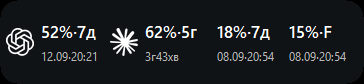

# LimitHalo

### Ліміти ШІ — перед очима.

Невеликий прозорий віджет для Windows, який показує залишок квоти Codex і, за бажанням, Claude. Постав його поруч із роботою, щоб не відкривати окреме вікно для перевірки.

**Публічна бета · Windows 10/11 x64 · Англійська за замовчуванням · MIT**

[Завантажити для Windows](https://github.com/DenisShumilov/LimitHalo/releases/download/v1.0.1-beta.1/LimitHalo-1.0.1-Setup.exe) · [Портативна версія](https://github.com/DenisShumilov/LimitHalo/releases/download/v1.0.1-beta.1/LimitHalo-1.0.1-Windows-x64.zip) · [Що нового](https://github.com/DenisShumilov/LimitHalo/releases) · [Повідомити про помилку](https://github.com/DenisShumilov/LimitHalo/issues/new?template=bug_report.yml)

[English — основна документація](README.md) · [Встановлення через ШІ](INSTALL_WITH_AI.md) · [Оновлення](docs/UPDATES.md) · [Приватність](PRIVACY.md)

*Згенерована рекламна концепція зі збільшеним віджетом і демонстраційними даними, а не скриншот застосунку. Справжній вигляд віджета показано нижче.*

> Публічна бета: посилання ведуть на `v1.0.1-beta.1` і стануть доступними після публікації випуску. Це не гарантія бездоганної роботи на будь-якому комп'ютері.

## Що він робить

- Показує залишок квоти й вікна її відновлення у компактному прозорому віджеті.
- Автоматично виявляє підтримувані інтеграції. Зайвий провайдер можна приховати; доступ до Claude потребує окремої згоди.
- Перетягується за невидиму область навколо іконок і тексту та зберігає вибрану позицію.
- Має спокійний чорно-білий вигляд. Кольори можна ввімкнути, а сповіщення про низький залишок спочатку вимкнені. Оновлення даних і програми, автозапуск та налаштування доступні правим кліком.

*Справжній рендерер віджета на підготовленому фоні, але всі значення демонстраційні. Це не дані реальних акаунтів і не доказ роботи інтеграцій після встановлення.*

## Що потрібно

- Windows 10 або 11, x64. Підтримка ARM64 у цій беті не заявлена.
- Для Codex — офіційне встановлення із сумісним app-server, який проходить перевірку, і наявна авторизація. Точні вимоги — в [описі інтеграції](INTEGRATIONS.md#codex-official-app-server-dependency).
- Для Claude — сумісні OAuth-дані Claude Code у `%USERPROFILE%\.claude\.credentials.json` та твоя окрема згода на доступ до квоти. Самого входу в Claude Desktop недостатньо.

Можна користуватися лише одним провайдером. Віджет не надає підписку, не створює акаунт і не збільшує ліміти. Назви часових вікон беруться з відповіді провайдера: вигаданого «денного ліміту Codex» немає.

## Як установити

Для звичайного використання вибери **інсталятор Windows** за посиланням угорі. На [сторінці випуску](https://github.com/DenisShumilov/LimitHalo/releases/tag/v1.0.1-beta.1) також є портативний ZIP, локальний ШІ-помічник, маніфест і контрольні суми. Автоматичні архіви GitHub **Source code** — це вихідний код, а не готова Windows-програма.

1. Звір SHA-256 із `SHA256SUMS.txt`. Збіг підтверджує цілісність файлів, але не особу видавця непідписаної програми.
2. Відкрий `LimitHalo-1.0.1-Setup.exe` або розпакуй портативний `LimitHalo-1.0.1-Windows-x64.zip`.
3. Залиш англійську або вибери українську. Дозволь Claude лише за потреби й після прочитання умов доступу.
4. Залиш увімкненим запуск наприкінці встановлення. Відкриється віджет або налаштування, якщо для роботи ще чогось бракує.

Звичайне встановлення вмикає запуск разом із Windows; його можна вимкнути правим кліком. Портативний режим не додає автозапуск. Обидва режими зберігають налаштування у `%LOCALAPPDATA%\AILimitsWidget\config.json`. Оновлення зберігає попередні налаштування та вибір автозапуску.

Для допомоги ШІ передай агенту весь розпакований комплект і [цю інструкцію](INSTALL_WITH_AI.md). Помічник нічого не завантажує й не потребує Python. Ти сам підтверджуєш конкретний непідписаний комплект, входиш до провайдера та надаєш згоду для Claude. Встановлення через ШІ використовує англійську; українську можна вибрати в ручному встановленні або налаштуваннях.

## Як оновлювати

Приблизно через 15 секунд після запуску, а потім кожні шість годин LimitHalo перевіряє випуски цього проєкту на GitHub у фоні. Пункт **Перевірити оновлення** у меню правого кліку перевіряє одразу. Нову версію буде видно в меню без нав'язливого спливаючого вікна.

Натисни **Завантажити**, щоб отримати повний комплект. Віджет звірить файли з SHA-256, отриманими від GitHub, і внутрішніми контрольними сумами комплекту. Перед установленням потрібно окремо підтвердити саме цю **непідписану** збірку. Локальний помічник оновить установлену програму та запустить її знову; попередні налаштування й вибір автозапуску зберігаються. Без твого підтвердження встановлення не починається.

У портативному режимі комплект завантажується, але замінити програму потрібно вручну. Швидкість залежить від інтернету; повний комплект містить і Setup, і портативний ZIP. Докладніше — [як працюють оновлення](docs/UPDATES.md) англійською.

## Приватність і обмеження бети

Немає телеметрії, аналітики, історії квот, читання чатів чи профілів браузера. Значення квот залишаються в оперативній пам'яті.

Codex працює через офіційний app-server. Claude використовує **непідтримуваний приватний інтерфейс Anthropic**: після твоєї згоди окремий нативний процес читає лише частину `claudeAiOauth` з файлу Claude Code і може оновити тільки її під час відновлення токена. Сам віджет не отримує токени. Приватний інтерфейс може змінитися або припинити роботу.

- Поточна збірка **не має цифрового підпису**. Windows може попереджати про це. Не обходь попередження для файлів, яким не довіряєш.
- **Перевірка автоматична, встановлення — за підтвердженням.** GitHub/TLS і збіг контрольних сум не засвідчують особу видавця непідписаної програми. Повний автоматичний відкат не гарантується.
- Сумісність із провайдерами може змінитися. Віджет вимикає несумісну інтеграцію, а не послаблює перевірки.
- Локальні тести не замінюють перевірку чистого встановлення, оновлення, відкату, видалення, реального перезапуску Windows і доступу до провайдерів. Для цієї збірки ще потрібна така перевірка власником на реальній машині.

Проєкт незалежний і не пов'язаний з OpenAI чи Anthropic. Повні межі — у [Privacy](PRIVACY.md), [Integrations](INTEGRATIONS.md) і [Security](SECURITY.md).

## Як допомогти

[Повідом про помилку](https://github.com/DenisShumilov/LimitHalo/issues/new?template=bug_report.yml): версія Windows, спосіб встановлення, видимий статус і очікувана поведінка. Особливо корисні відгуки про перший запуск, оновлення, повторне підключення та позицію після запуску Windows або зміни монітора.

Не публікуй токени, облікові дані, сирі відповіді провайдера, чати, журнали чи приватні скриншоти. Для чутливих проблем дотримуйся [політики безпеки](SECURITY.md).

Основна технічна документація — англійською: [розробка](docs/DEVELOPMENT.md), [внесок у проєкт](CONTRIBUTING.md), [підготовка першої публікації](docs/PUBLISHING.md). Код — за [ліцензією MIT](LICENSE), без гарантій.
